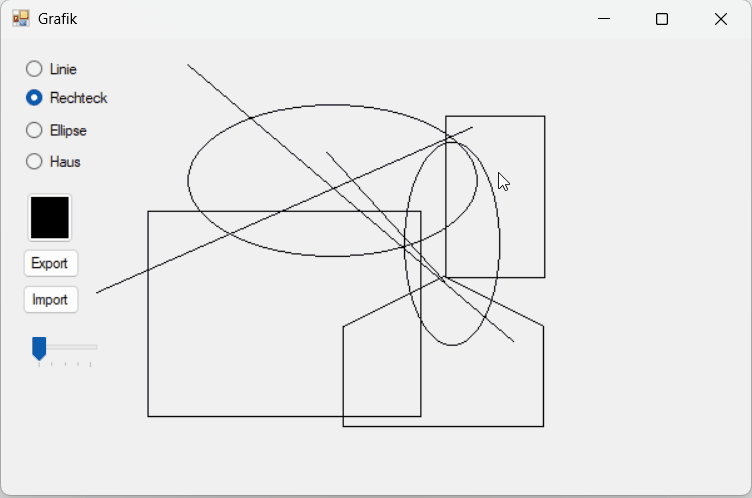

# Grafik

Ein Zeichenprogramm (C# / WinForms) zum interaktiven Erstellen verschiedener geometrischer Formen per Maus, mit Export/Import der gezeichneten Objekte als CSV-Datei.

## Demo



## Funktionen

- **Formen zeichnen per Maus:** Linie, Rechteck, Ellipse, Quadrat, Kreis und ein Haus (als zusammengesetztes Polygon)
- **Modifiertaste Shift:** wandelt beim Zeichnen ein Rechteck automatisch in ein Quadrat bzw. eine Ellipse in einen Kreis um
- **Farbwahl und Strichstärke** frei einstellbar über einen Farbdialog bzw. einen Schieberegler
- **Haus drehen:** Rechtsklick auf ein gezeichnetes Haus dreht es schrittweise, mittlere Maustaste setzt es auf die ursprüngliche Position zurück
- **Export/Import als CSV:** Alle gezeichneten Objekte lassen sich in eine CSV-Datei speichern und später wieder in die Zeichenfläche laden

## Technologien

- C# (.NET, Windows Forms)
- GDI+ für die Zeichenlogik (`Graphics`, `GraphicsPath`, `Matrix`-Transformationen für die Rotation)
- Objektorientierte Architektur mit Vererbung und Polymorphismus (`abstract class`, `override`)
- Einfache CSV-Serialisierung für Export/Import

## Architektur

Die Formen sind als Vererbungshierarchie aufgebaut, ausgehend von der abstrakten Basisklasse `cls_Grafikobjekt`:

```
cls_Grafikobjekt (abstract)
├── cls_Linie
├── cls_Rechteck
│   ├── cls_Quadrat
│   └── cls_Haus
└── cls_Ellipse
    └── cls_Kreis
```

Jede Form überschreibt die abstrakte Methode `Zeichne()` mit ihrer eigenen Zeichenlogik. `cls_Quadrat` und `cls_Kreis` erben die komplette Logik ihrer Basisklasse (`cls_Rechteck` bzw. `cls_Ellipse`) und überschreiben nur `SetzeEndpunkt()`, um Breite und Höhe beim Zeichnen automatisch anzugleichen. `cls_Haus` erbt ebenfalls von `cls_Rechteck`, nutzt aber zusätzlich einen `GraphicsPath` mit fünf Eckpunkten, um die Hausform als Polygon darzustellen, und kann über eine Rotationsmatrix gedreht werden.

## Was ich dabei gelernt habe

- Umstieg von einer typbasierten `if/else`-Unterscheidung auf echten Polymorphismus mit `abstract`-Methoden – dadurch entscheidet jede Klasse selbst, wie sie sich zeichnet, statt dass eine zentrale Methode alle Fälle unterscheiden muss
- Aufbau einer sinnvollen Vererbungshierarchie (z. B. Quadrat als Spezialfall eines Rechtecks, Kreis als Spezialfall einer Ellipse)
- Arbeiten mit `GraphicsPath` und Transformationsmatrizen für komplexere, drehbare Formen
- Einfache eigene Serialisierung von Objekten in ein CSV-Format für Export/Import

## Ausführen

1. Projekt in Visual Studio öffnen
2. Build starten (F5) – Zielplattform: Windows (.NET)
3. Form auswählen, Farbe und Strichstärke einstellen, mit der Maus auf der Zeichenfläche zeichnen
